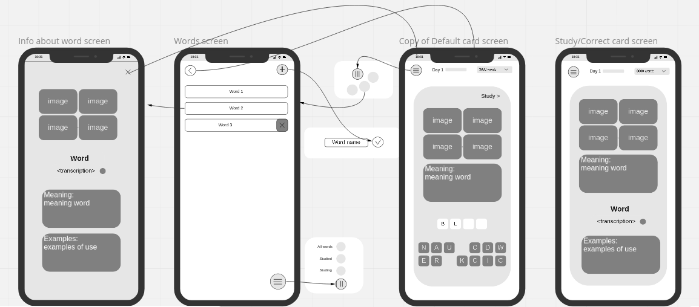
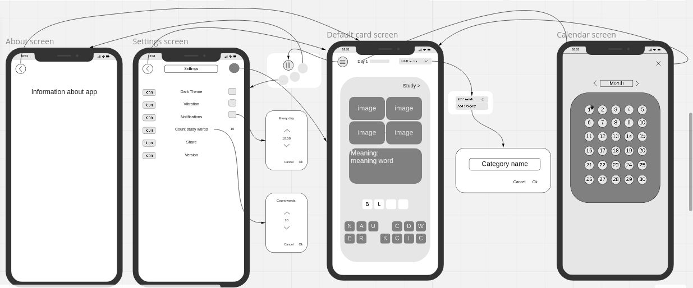

# 3000 words puzzle

## 1. Part 1
### 1.1 Study/Correct card screen:
I can look up the meaning of word and pictures
I can look up example of use and transcription
I can hear word pronunciation
I can call menu.
I can change or create new category of words.
I have information about current progress
I have information about count days of use app

Buttons:
* Menu: Settings - About - Words
* Number of day
* Change category
* Play sound pronunciation

### 1.2 Words screen:
I can choose type words.
I can add new words.
I can remove words.
I can go back to card screen.
I can look up information about the word

Buttons:
* Back
* Add new word
* Menu: All words - Studied  - Studying
* Words
* Scroll word - delete word

### 1.3 Info about word screen:
I am seeing information about selected word. 
I can go back.

Button:
* Close

## 2. Part 2
### 2.1 Default card screen:
I can look up the meaning of the word
I can look up the pictures
I can make word from letters
I can call menu.
I can change or create new category of words.
I have information about current progress
I have information about count days of use app
I can send the word to study

Buttons:
* Menu: Settings - About - Words
* Number of day
* Change or ad new category
* Letters
* Study

### 2.2 History progress screen:
I get information about current date and history of use app
I can go back to card screen

Buttons:
* Close
* Change month

### 2.3 Settings screen:
I can change settings app.

Buttons:
* Back
* Save
* Theme
* Vibration
* Notification
* Count study words
* Share

### 2.4 About screen:
I get information about app

Buttons:
* Back

